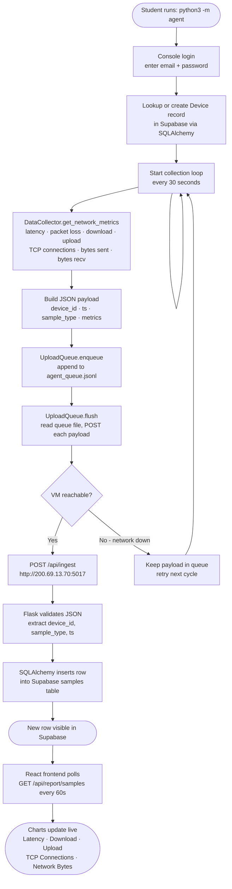
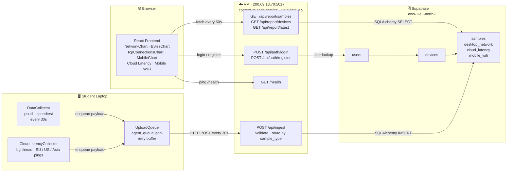
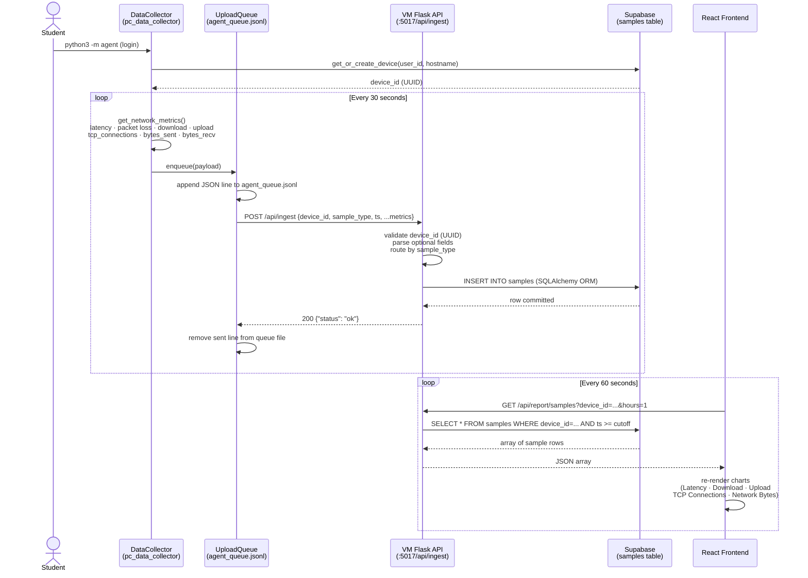

# Context of Code — System Diagrams

> Preview with: `Cmd+Shift+V` (requires [Markdown Preview Mermaid Support](https://marketplace.visualstudio.com/items?itemName=bierner.markdown-mermaid))

---

## 1. Project Structure

```mermaid
graph TD
    Root["📁 context-of-code/"]

    Root --> Agent["📁 agent/"]
    Root --> WebApp["📁 web_app/"]
    Root --> Common["📁 common/"]
    Root --> Frontend["📁 frontend/"]

    Agent --> AgentEntry["__main__.py · entry point"]
    Agent --> PCCollector["📁 pc_data_collector/\nDataCollector · get_network_metrics()"]
    Agent --> CloudCollector["📁 cloud_latency_collector/\nbackground thread · pings EU/US/Asia"]
    Agent --> UQueue["📁 uploader_queue/\nUploadQueue · file-backed retry queue"]

    PCCollector --> CLIAuth["cli/console_auth.py · login prompt"]
    PCCollector --> MainPy["main.py · run() · run_with_user()"]

    WebApp --> AppPy["app.py · Flask + CORS · /health"]
    WebApp --> BP["📁 blueprints/"]
    BP --> ApiPy["api.py · POST /api/ingest"]
    BP --> ReportPy["reporting.py · GET /api/report/*"]
    BP --> AuthPy["auth.py · POST /api/auth/*"]

    Common --> DBDir["📁 database/"]
    DBDir --> ORM["db_dataclasses.py · ORM models\nUser · Password · Device · Sample"]
    DBDir --> DBOps["db_operations.py · Database class\ninsert · query · get_or_create_device"]
    Common --> Settings["settings.py · env config"]

    Frontend --> AppJSX["App.jsx · polls every 60s"]
    Frontend --> ApiJS["api.js · fetch wrappers"]
    Frontend --> Charts["NetworkChart · BytesChart\nTcpConnectionsChart · MobileChart"]
    Frontend --> UIComp["AuthScreen · DeviceSelector\nMetricCard · StatusBadge"]
```

---

## 2. Demo Flowchart

---

## 3. Full System Architecture

---

## 4. Data Flow Sequence

